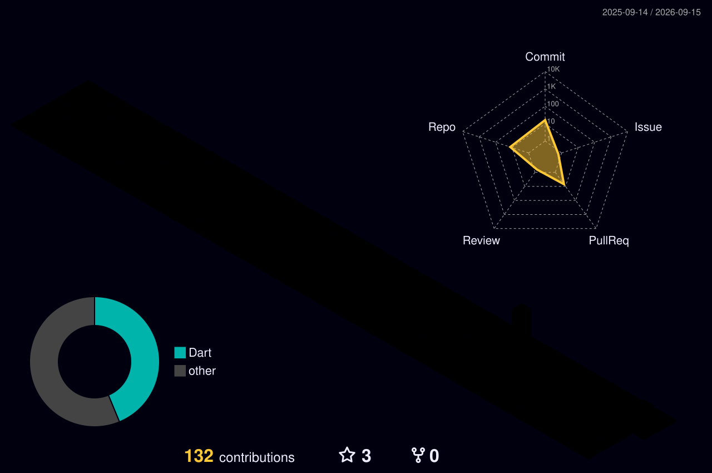

<h1 align="center">Hi, I'm Khongorzul 👋</h1>

  Flutter &amp; iOS developer from Mongolia.
   
  Currently contributing to <a href="https://github.com/Nebulyn-Labs/MediFlow">MediFlow</a>, an AI-powered medical logistics platform.

  
  

---

## 🛠 Tech Stack

  
  
  
  
  
  

---

## ⭐ GitHub Analytics

  

  
  

  
  

  

  

  

  <picture>
    <source media="(prefers-color-scheme: dark)"
            srcset="https://raw.githubusercontent.com/khongorzul1120/khongorzul1120/output/github-snake-dark.svg" />
    <source media="(prefers-color-scheme: light)"
            srcset="https://raw.githubusercontent.com/khongorzul1120/khongorzul1120/output/github-snake.svg" />
    
  </picture>

---

## 📌 What I'm working on

- **[MediFlow](https://github.com/Nebulyn-Labs/MediFlow)** — refactoring the AI service layer: consolidated duplicated fallback handling across six Gemini workflows into a single shared helper, with regression tests.
- Flutter apps for iOS and Android.

---

  

